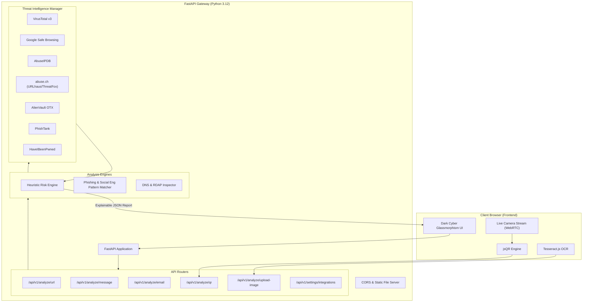

<div align="center">

# 🛡️ ScamShield
### Personal Cybersecurity Assistant & Real-Time Threat Intelligence Engine
**Understand Before You Trust — Explainable Scam, Phishing, and Quishing Detection**

[](https://scamshield-wi07.onrender.com/)
[](https://fastapi.tiangolo.com)
[](https://www.python.org/)
[](LICENSE)
[](#-zero-database-privacy-guarantee)
[](#-10-threat-intelligence-integrations)

<br/>

<p align="center">
  <a href="https://scamshield-wi07.onrender.com/">
    
  </a>
</p>

[🌐 **Explore Live Production Deployment**](https://scamshield-wi07.onrender.com/) • [📖 **Interactive Swagger API Docs**](https://scamshield-wi07.onrender.com/docs) • [🚀 **Deploy Your Own on Render**](#-render-deployment-guide)

</div>

---

## 📋 Table of Contents
- [✨ Key Highlights](#-key-highlights)
- [🎯 The Problem ScamShield Solves](#-the-problem-scamshield-solves)
- [🔍 Core Modules & Capabilities](#-core-modules--capabilities)
  - [1. URL Radar & Heuristic Engine](#1-url-radar--heuristic-engine)
  - [2. QR Quishing Scanner with Live Camera HUD](#2-qr-quishing-scanner-with-live-camera-hud)
  - [3. Screenshot Fraud OCR Analyzer](#3-screenshot-fraud-ocr-analyzer)
  - [4. SMS & Social Engineering Detector](#4-sms--social-engineering-detector)
  - [5. Email Spoofing & Header Analyzer](#5-email-spoofing--header-analyzer)
- [⚡ 10 Threat Intelligence Integrations](#-10-threat-intelligence-integrations)
- [🔒 Zero-Database Privacy Guarantee](#-zero-database-privacy-guarantee)
- [🏗️ System Architecture](#️-system-architecture)
- [🚀 Quick Start (Local Setup)](#-quick-start-local-setup)
- [☁️ Render Deployment Guide](#️-render-deployment-guide)
- [📡 API Reference](#-api-reference)
- [📜 License](#-license)

---

## ✨ Key Highlights

- **Explainable Cybersecurity**: Moves beyond opaque *"Scam / Not Scam"* binaries. ScamShield calculates an exact 0–100 risk score, flags suspicious indicators (e.g. typosquatting, subdomains mimicry, homoglyphs), and provides clear, actionable advice for non-technical users.
- **5 Multi-Vector Analysis Surfaces**: Full coverage for **URLs**, **SMS/Chat Messages**, **Phishing Emails**, **Screenshots (OCR)**, and **QR Codes (Quishing)**.
- **Live Camera HUD for QR Codes**: Open your device's camera to scan suspicious QR codes in real-time with an animated cyber reticle, auto-decode payloads via client-side `jsQR`, and inspect destinations safely before browsing.
- **Browser-Side OCR with Tesseract.js**: Extracts text from screenshots directly in the browser or via server-side fallback, ensuring instantaneous optical character recognition without third-party cloud data harvesting.
- **10 Unified Threat Intelligence Feeds**: Real-time correlation across VirusTotal, Google Safe Browsing, AbuseIPDB, URLhaus, ThreatFox, AlienVault OTX, PhishTank, HaveIBeenPwned, RDAP WHOIS, and DNS Inspector.
- **Zero-DB Core Architecture**: Complete in-memory ephemeral processing. API keys are loaded directly into environment memory without persisting user scans, submitted links, or text payloads to disk or external databases.

---

## 🎯 The Problem ScamShield Solves

Millions of users fall victim to cyber fraud daily across SMS, WhatsApp, phishing emails, counterfeit banking websites, and malicious QR codes pasted over parking meters or restaurant menus. 

Traditional enterprise security tools return cryptic warnings like `DMARC SPF Fail` or `C2 IOC Detected` that everyday users do not understand. **ScamShield bridges this gap with an intuitive 4-step pipeline:**

```
Incoming Content  ──▶  Signal Extraction  ──▶  Multi-Engine Consensus  ──▶  Explainable Diagnostic Report
(URL / SMS / QR)        (Heuristics + OCR)     (10 Feeds + Risk Scoring)      (0-100 Score + What to Do)
```

---

## 🔍 Core Modules & Capabilities

### 1. URL Radar & Heuristic Engine

Evaluates links against homograph attacks, typosquatting, high-risk TLDs (`.top`, `.xyz`, `.click`), punycode obfuscation, entropy variations, and live threat intelligence feeds.

<p align="center">
  
</p>

- **Diagnostic Speedometer**: Visualizes threat level (0–39 SAFE, 40–69 SUSPICIOUS, 70–100 CRITICAL).
- **Consensus Breakdown**: Flags whether the domain is listed on VirusTotal, Google Safe Browsing, or URLhaus.
- **WHOIS / RDAP Registration Inspection**: Detects freshly registered domains created within the last 14 days specifically for active phishing campaigns.

---

### 2. QR Quishing Scanner with Live Camera HUD

Protects against **Quishing** (QR code phishing) where deceptive QR codes conceal malicious phishing landing pages.

<p align="center">
  
</p>

- **Live Camera Scanner**: Automatically tracks and decodes QR codes in real-time from webcam or mobile rear camera.
- **Drag-and-Drop Image Support**: Drag any QR image or screenshot directly into the dropzone.
- **Payload Extraction & Sandboxed Inspection**: Resolves and parses redirect chains, URI schemes (`http`, `market://`, `bitcoin:`), and embedded links before you open them.

---

### 3. Screenshot Fraud OCR Analyzer
Paste or upload screenshots of suspicious texts, investment apps, or login portals. Powered by **Tesseract.js**, ScamShield performs client-side OCR text extraction in real time and submits the extracted signals for deceptive keyword analysis.

### 4. SMS & Social Engineering Detector
Identifies psychological coercion signals including:
- Artificial urgency (*"Account suspended within 2 hours"*)
- Authority impersonation (*"IRS Notification"*, *"USPS Package Issue"*)
- Financial lure (*"Lottery won"*, *"Crypto investment guaranteed 400% return"*)
- Request for sensitive info (*"Send OTP"*, *"Verify seed phrase"*)

### 5. Email Spoofing & Header Analyzer
Cross-checks sender display names against actual `From:` and `Reply-To:` email addresses to unmask display-name spoofing, cousin-domain counterfeits, and credential harvest triggers.

---

## ⚡ 10 Threat Intelligence Integrations

ScamShield orchestrates a multi-tier defense combining local fast heuristics with industry threat databases:

| # | Provider / Feed | Coverage & Purpose | Detection Capability |
| :-: | :--- | :--- | :--- |
| **1** | **VirusTotal v3** | 70+ Antivirus & URL Security Engines | Malware, Phishing, C2 Botnet domains |
| **2** | **Google Safe Browsing v4** | Google Chrome & Android Ecosystem Blacklist | Social engineering, deceptive sites |
| **3** | **AbuseIPDB v2** | Global Malicious IP Reputation Database | DDoS, botnets, brute-force hosting IPs |
| **4** | **abuse.ch URLhaus** | Community-driven Malware Distribution URLs | Ransomware hosts, Trojan downloaders |
| **5** | **abuse.ch ThreatFox** | Indicators of Compromise (IOCs) | Threat actor infrastructure & hashes |
| **6** | **AlienVault OTX** | Open Threat Exchange Adversary Pulses | Targeted cyber campaigns & APT signals |
| **7** | **PhishTank** | Community-Verified Phishing Database | Zero-hour crowd-sourced phishing reports |
| **8** | **HaveIBeenPwned (HIBP)** | k-Anonymity Credential Breach Intelligence | Compromised account & password verification |
| **9** | **RDAP / WHOIS Engine** | Domain Registrar & Creation Timestamp | Brand-new domain detection (< 14 days) |
| **10** | **DNS Inspector** | MX, NS & SPF Record Verifier | Fake mail exchangers & parked domains |

> [!TIP]
> API keys can be entered directly via the **Threat Feeds** modal in the UI or set inside `.env`. ScamShield works out-of-the-box even without API keys using its built-in heuristic detection algorithms.

---

## 🔒 Zero-Database Privacy Guarantee

ScamShield is architected for strict user privacy:
- **No Database Dependencies**: Uses an ephemeral in-memory session model. No PostgreSQL, MySQL, SQLite, or Mongo required.
- **Zero Scan Persistence**: Your analyzed messages, emails, and uploaded screenshot buffers are processed in memory and discarded immediately after returning the diagnostic response.
- **Local Client-Side Processing**: QR decoding and OCR runs directly in your browser whenever supported.

---

## 🏗️ System Architecture



---

## 🚀 Quick Start (Local Setup)

### Prerequisites
- **Python 3.10+** (Python 3.12 recommended)
- **Git**

### Installation Steps

1. **Clone the Repository**
   ```bash
   git clone https://github.com/your-username/scamshield.git
   cd scamshield
   ```

2. **Create and Activate Virtual Environment**
   ```bash
   # Windows
   python -m venv venv
   .\venv\Scripts\activate

   # macOS / Linux
   python3 -m venv venv
   source venv/bin/activate
   ```

3. **Install Dependencies**
   ```bash
   pip install -r requirements.txt
   ```

4. **Configure Environment Keys (Optional)**
   Copy `.env.example` or create `.env`:
   ```bash
   # .env
   PORT=8000
   HOST=127.0.0.1
   
   # Threat Feeds (Optional - Heuristics work without them)
   VIRUSTOTAL_API_KEY=your_key_here
   GOOGLE_SAFEBROWSING_API_KEY=your_key_here
   ABUSEIPDB_API_KEY=your_key_here
   ABUSECH_API_KEY=your_key_here
   ALIENVAULT_OTX_API_KEY=your_key_here
   ```

5. **Start ScamShield**
   ```bash
   python run.py
   ```
   *ScamShield will automatically launch in your default web browser at `http://127.0.0.1:8000`.*

---

## ☁️ Render Deployment Guide

Deploying ScamShield to [Render](https://render.com) takes less than 2 minutes as a **Web Service**:

### Step 1: Create New Web Service
- Link your GitHub repository in the **Render Dashboard**.
- **Runtime**: `Python 3`
- **Region**: Closest to your users

### Step 2: Configure Build & Start Commands

| Setting | Value |
| :--- | :--- |
| **Build Command** | `pip install -r requirements.txt` |
| **Start Command** | `uvicorn backend.main:app --host 0.0.0.0 --port $PORT` |

### Step 3: Add Environment Variables
Under the **Environment** tab, configure:
- `PYTHON_VERSION`: `3.12.8`
- *(Optional)* Add your API keys (`VIRUSTOTAL_API_KEY`, `GOOGLE_SAFEBROWSING_API_KEY`, etc.)

Click **Deploy Web Service**. Your service will be live at:
`https://your-service-name.onrender.com`

---

## 📡 API Reference

Interactive OpenAPI documentation is generated automatically:
- **Swagger UI**: [https://scamshield-wi07.onrender.com/docs](https://scamshield-wi07.onrender.com/docs)
- **ReDoc**: [https://scamshield-wi07.onrender.com/redoc](https://scamshield-wi07.onrender.com/redoc)

### Primary Endpoints

| Method | Endpoint | Description | Sample Request |
| :--- | :--- | :--- | :--- |
| `GET` | `/api/health` | Health Check | `{}` |
| `POST` | `/api/v1/analyze/url` | URL Phishing & Reputation Radar | `{"url": "https://secure-login.top"}` |
| `POST` | `/api/v1/analyze/message` | SMS & Chat Social Engineering | `{"message": "Urgent: Account locked"}` |
| `POST` | `/api/v1/analyze/email` | Phishing Email & Spoof Inspector | `{"sender": "x@bank.com", "subject": "..."}` |
| `POST` | `/api/v1/analyze/qr` | QR Code Payload & Destination Scan | `{"payload": "https://bit.ly/3xY"}` |
| `POST` | `/api/v1/analyze/upload-image`| Screenshot File Multi-Part Upload | `multipart/form-data (file)` |
| `GET` | `/api/v1/settings/integrations`| Status of 10 Threat Feeds | `{}` |

---

## 📜 License

Distributed under the **MIT License**. See `LICENSE` for more information.

---

<div align="center">
  <b>Built with 🛡️ for a safer internet</b><br>
  <sub>Understand Before You Trust</sub>
</div>
